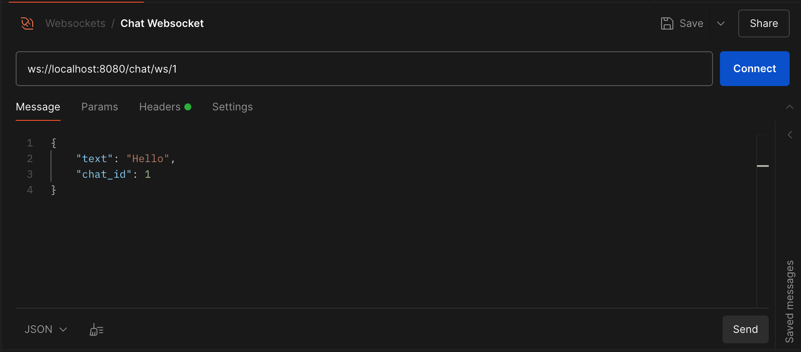
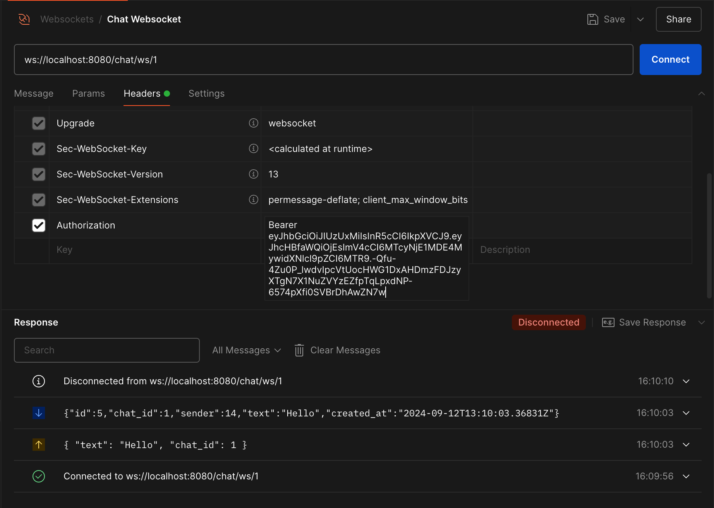

# Simple Chat server

## Contents

- [About](#about-project)
- [Installation](#installation)
- [Grafana](#grafana)
- [Usage](#usage)

## About project

Simple Chat is a simple Go-based HTTP server that uses websockets and an optional gRPC microservice for authorization.

> For full operation of the service, it is necessary to start the authorization service [bordviz/sso-grpc](https://github.com/bordviz/sso-grpc/)

## Installation

- [Local Installation](#local-installation)
- [Docker](#docker)

### Local installation
To migrate to the database, run the following command from the root of the project:

```bash
go run cmd/migrations/main.go --action=up
```

To start the application, you need to run the following commands in the root of the project:

```bash
go build -o build/main cmd/simple-chat/main.go
```
```bash
./build/main
```
Or run without creating a binary
```bash
go run cmd/simple-chat/main.go
```

### Docker
> IMPORTANT If you have made changes to the configuration files, check them against the parameters specified in docker-compose.yml

To start a project using Docker, run the following command from the root of the project:
```bash
docker-compose up -d
```
To stop, use:
```bash
docker-compose down
```

## Grafana

If you are running a project using Docker and the env mode is `dev` or `prod`, you can monitor logs using the Grafana Loki service. To access the service, go to `http://localhost:3000`, enter `root` as login and `chat-root` as password. In the menu, open the Dashboards tab and select the added `Chat logs` dashboard. 

## Usage
To use the API, you can download the Postman collection [Postman Collection](./Simple%20Chat.postman_collection.json)

The images below show an example of using a websocket for a chat room:



In order for the websocket to work properly, you need to send the token to the user in Headers



### ⭐️ If you like my project, don't spare your stars 🙃
